# ChronoLux — Luxury Watch Store

[](https://react.dev)
[](https://nodejs.org)
[](https://expressjs.com)
[](https://aws.amazon.com/rds/aurora/)
[](https://hub.docker.com)
[](https://aws.amazon.com/eks/)
[](https://www.terraform.io)
[](https://github.com/features/actions)

A production-grade luxury watch e-commerce platform deployed on AWS using a fully automated GitOps pipeline. The infrastructure is provisioned with Terraform, containerized workloads run on AWS EKS with Fargate, and every push to `main` triggers automated CI/CD pipelines via GitHub Actions.

---

## Architecture

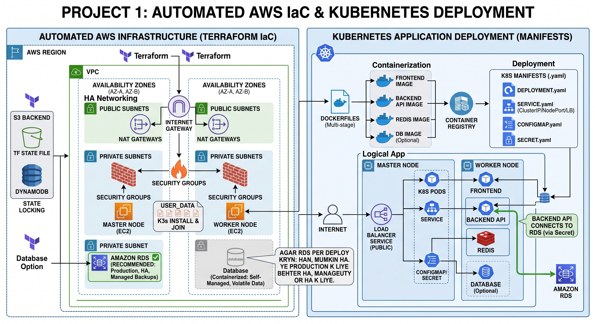

### How it works end-to-end

User traffic enters through an **AWS ALB (Application Load Balancer)** acting as the Kubernetes Ingress Controller. The ALB routes requests to the appropriate pods running inside a **private EKS Fargate cluster** (`watch-store-eks-cluster`) in `eu-north-1`.

```
Internet / Users
      │
      ▼
Internet Gateway
      │
      ▼
AWS ALB (Ingress Controller) — Public Subnet
      │
      ├── /        → Frontend Pods  (Nginx, Port 80)
      └── /api     → Backend Pods   (Node.js, Port 4000)
                          │
                          ├── Redis Pod       (Port 6379, ClusterIP)
                          └── Aurora PostgreSQL Cluster
                                  (Multi-AZ, Private Subnet)
```

Secrets such as DB credentials, SMTP config, and password salt are stored in **AWS Secrets Manager** and injected into pods via Kubernetes ConfigMaps and Secrets at deploy time.

---

## AWS Infrastructure

| Resource | Details |
|---|---|
| Region | `eu-north-1` (Stockholm) |
| VPC | `10.0.0.0/16`, spanning 3 Availability Zones |
| Public Subnets | Internet Gateway + AWS ALB (Ingress) |
| Private Subnets (App) | EKS Fargate cluster, Frontend & Backend pods |
| Private Subnets (DB) | Aurora PostgreSQL cluster, RDS DB Subnet Group |
| EKS Cluster | `watch-store-eks-cluster` — managed control plane with AWS Fargate profiles |
| Database | AWS Aurora PostgreSQL, 2 Multi-AZ nodes |
| Secrets | AWS Secrets Manager (`watch-store/postgres/credentials`) |
| Jump Host / Runner | EC2 instance used as a GitHub self-hosted runner for `kubectl` deployments and DB migrations |

All of this is provisioned via **Terraform IaC** — no resources are created manually.

---

## Application Stack

| Layer | Technology |
|---|---|
| Frontend | React 19, TypeScript, Vite, Tailwind CSS, Zustand |
| Backend | Node.js 22, Express 4, Multer, UUID |
| Database | AWS Aurora PostgreSQL (via `pg` driver) |
| Cache / OTP Store | Redis (in-cluster pod, Port 6379) |
| Auth | OTP-based flow via email (Nodemailer / SMTP) |
| Notifications | Twilio SMS (optional), email purchase confirmations |
| Container Registry | Docker Hub (`dani334/watch-store-frontend`, `dani334/watch-store-backend`) |

---

## Application Features

- Luxury watch storefront with category browsing and product detail pages
- Shopping cart, checkout, and order tracking flow
- OTP-verified user registration and password reset via email
- Order placement with OTP verification and email confirmation
- Admin dashboard — manage products, users, orders, and view sales reports
- Redis-backed product caching and OTP session storage
- Image upload support (Multer, stored in `/public/uploads`)

---

## Screenshots

### Storefront

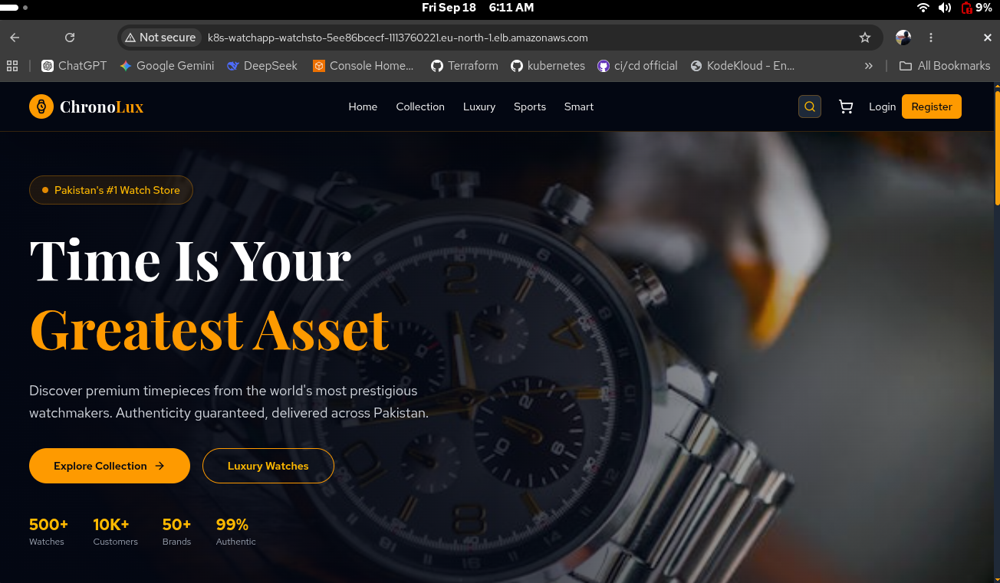

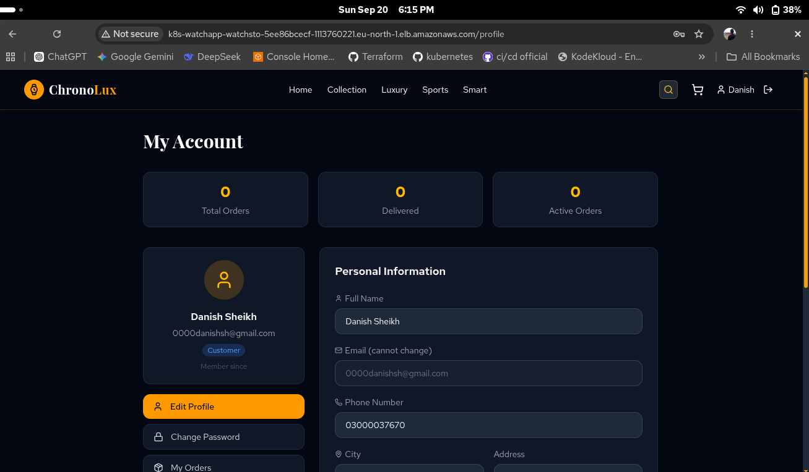

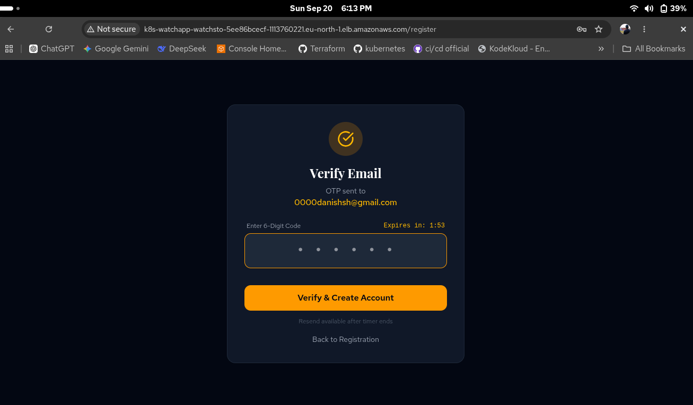

### Deployment & Infrastructure

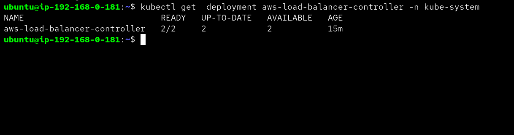

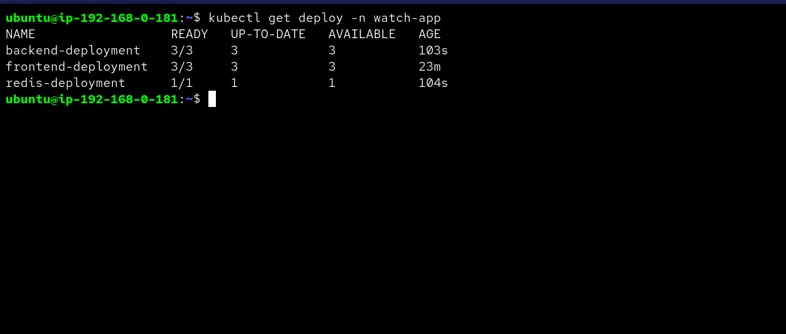

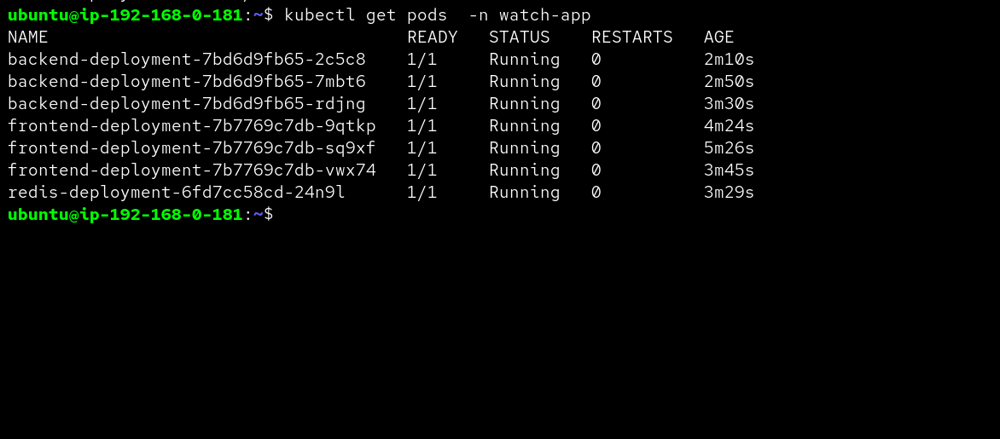

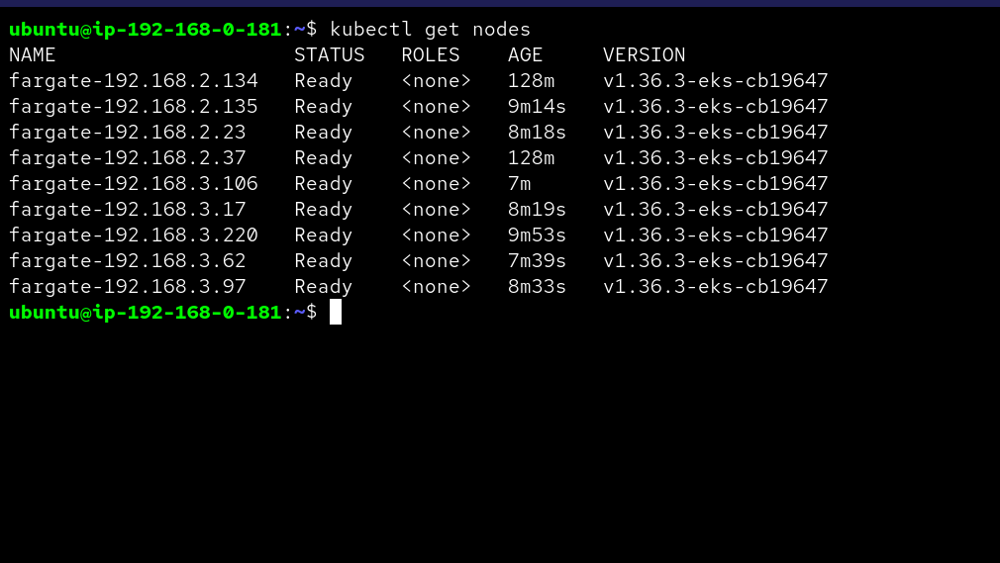

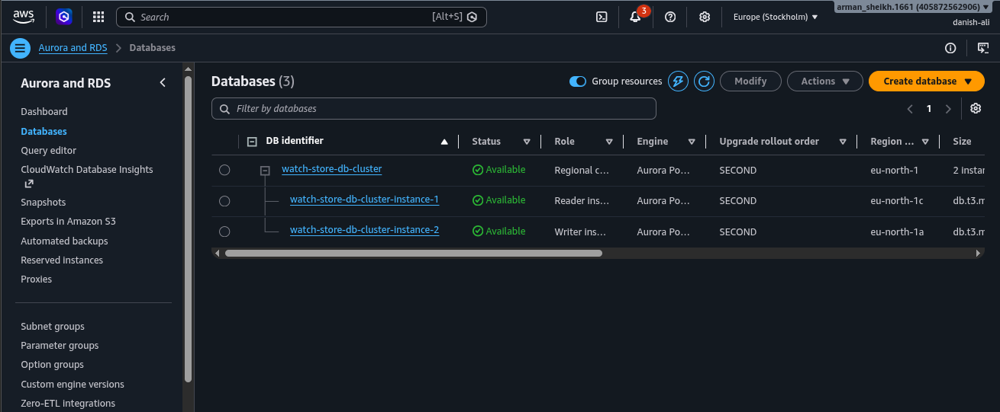

### CI/CD Pipelines

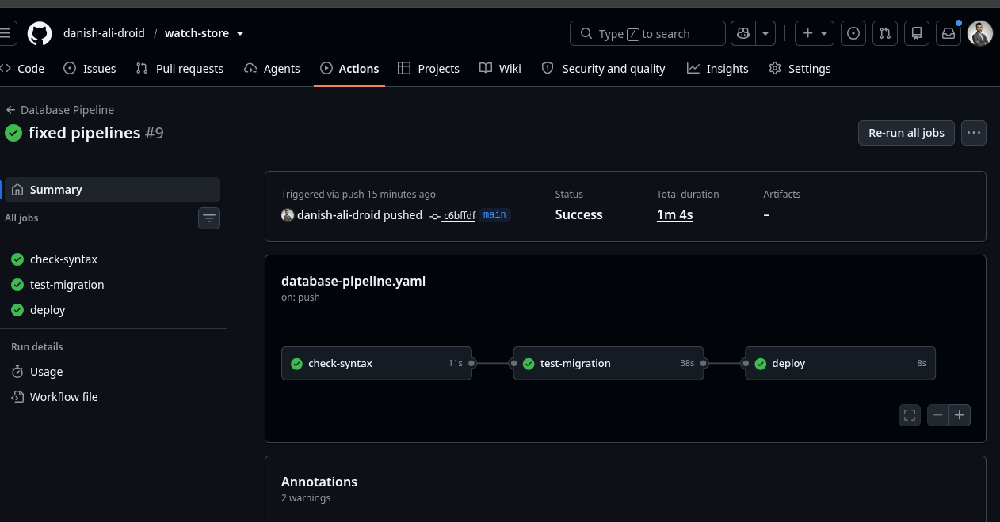

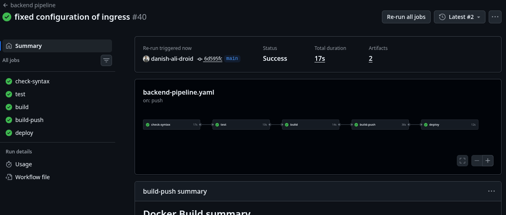

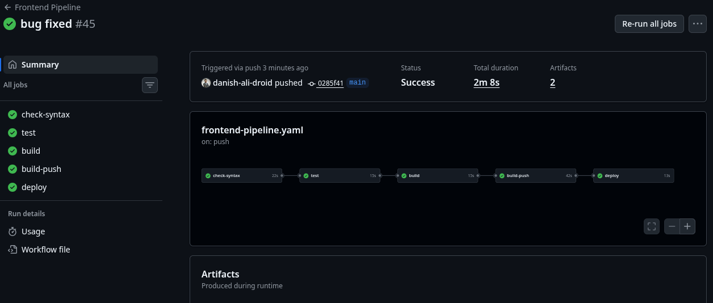

---

## CI/CD Pipelines

All pipelines are defined under [`.github/workflows`](.github/workflows) and are triggered by path-scoped pushes to `main`. Deployments run on a **self-hosted EC2 GitHub Runner** that has `kubectl` and `aws cli` configured.

### 1. Infrastructure Pipeline — `terraform.yaml`

**Trigger:** push to `terraform/**`

- Configures AWS credentials
- Runs `terraform init` → `terraform plan` → `terraform apply`
- Provisions VPC, subnets, security groups, EKS cluster, Aurora RDS, and IAM resources

### 2. Database Pipeline — `database-pipeline.yaml`

**Trigger:** push to `db/**`

- Lints SQL files with **SQLFluff** (PostgreSQL dialect)
- Runs schema and seed SQL against an ephemeral **PostgreSQL 16** container to validate migrations
- On success, connects to the live **Aurora RDS** cluster via the self-hosted runner, fetches credentials from **AWS Secrets Manager**, and applies all `.sql` files in order

### 3. Backend Pipeline — `backend-pipeline.yaml`

**Trigger:** push to `backend/**` or `manifests/backend-deployment.yaml`

Jobs run sequentially:

1. **check-syntax** — Prettier format check; auto-fixes and commits if needed
2. **test** — runs `npm test --coverage`, uploads coverage report as artifact
3. **build** — `npm run build` (esbuild bundle), uploads `dist/` as artifact
4. **build-push** — builds Docker image and pushes to Docker Hub with `latest` and `${{ github.sha }}` tags
5. **deploy** (self-hosted runner) — updates kubeconfig, applies Kubernetes manifests, rolls out the new image with `kubectl set image`, waits for rollout status

### 4. Frontend Pipeline — `frontend-pipeline.yaml`

**Trigger:** push to `src/**` (excludes backend/db/terraform paths)

Jobs run sequentially:

1. **check-syntax** — ESLint + Prettier check; auto-fixes and commits if needed; TypeScript strict type check (`tsc --noEmit`)
2. **test** — runs `npm test --coverage`, uploads coverage report as artifact
3. **build** — Vite production build, uploads `dist/` as artifact
4. **build-push** — builds Docker image and pushes to Docker Hub
5. **deploy** (self-hosted runner) — fetches secrets from **AWS Secrets Manager**, injects them via `envsubst` into ConfigMap and Secret manifests, applies all manifests, and restarts the frontend deployment

---

## Kubernetes Manifests

All manifests live in [`manifests/`](manifests):

| File | Purpose |
|---|---|
| `ns.yaml` | Creates the `watch-app` namespace |
| `watch-app-cm.yaml` | ConfigMap with DB host and app config |
| `watch-app-secret.yaml` | Kubernetes Secret for DB password, SMTP, and salt |
| `frontend-deployment.yaml` | Frontend Deployment (3 replicas, Nginx/Port 80) + Service |
| `backend-deployment.yaml` | Backend Deployment (3 replicas, Node.js/Port 4000) + Service |
| `redis-deployment.yaml` | Redis Deployment (1 replica, Port 6379) + ClusterIP Service |
| `ingress-resource.yaml` | ALB Ingress — routes `/` to frontend, `/api` to backend |

### Ingress routing

```yaml
rules:
  - http:
      paths:
        - path: /        → frontend-service:80
        - path: /api     → backend-service:4000
```

---

## Repository Structure

```
watch-store/
├── .github/
│   └── workflows/
│       ├── terraform.yaml            # Infrastructure pipeline
│       ├── database-pipeline.yaml    # Database migration pipeline
│       ├── backend-pipeline.yaml     # Backend CI/CD pipeline
│       └── frontend-pipeline.yaml    # Frontend CI/CD pipeline
├── backend/
│   ├── src/
│   │   ├── index.js                  # Express API server
│   │   ├── db.js                     # PostgreSQL connection
│   │   └── services/
│   │       ├── emailService.js       # Nodemailer OTP + confirmation emails
│   │       └── redisService.js       # Redis cache and OTP store
│   ├── Dockerfile
│   └── package.json
├── db/
│   ├── schema.sql                    # Database schema
│   └── seed.sql                      # Seed data
├── manifests/
│   ├── ns.yaml
│   ├── watch-app-cm.yaml
│   ├── watch-app-secret.yaml
│   ├── frontend-deployment.yaml
│   ├── backend-deployment.yaml
│   ├── redis-deployment.yaml
│   └── ingress-resource.yaml
├── src/                              # React frontend source
├── terraform/                        # Terraform IaC for AWS
├── public/                           # Static assets and uploads
├── Dockerfile                        # Frontend Docker build
├── index.html
├── package.json
├── vite.config.ts
└── tsconfig.json
```

---

## Secrets and Configuration

Secrets are never hardcoded. The pipeline retrieves them at runtime:

```bash
aws secretsmanager get-secret-value \
  --secret-id "watch-store/postgres/credentials" \
  --region eu-north-1
```

The secret contains:
- `DB_HOST` — Aurora cluster endpoint
- `DB_PASSWORD` — database password
- `SMTP_USER` / `SMTP_PASS` — email credentials
- `PASSWORD_SALT` — password hashing salt

These are injected as Kubernetes ConfigMap and Secret objects via `envsubst` during the deploy step.

---

## License

This project is intended for learning, demonstration, and portfolio use.
